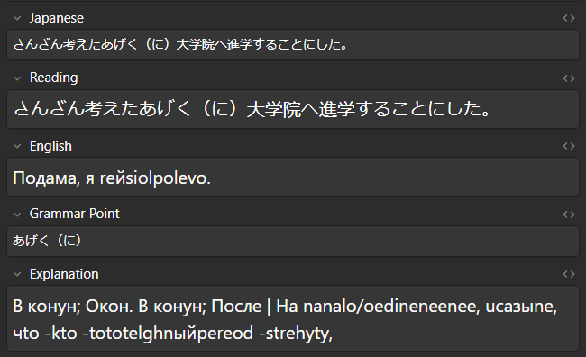

# Anki Translator

Автоматизирует перевод указанных полей в карточках Anki.


---

## 🌟 Особенности

- **Настройка** через `config.json`
- Поддержка **вложенных колод** (например, `"deck_name": "Wanikani Ultimate::Vocabulary"`)
- Пакетный перевод нескольких полей за один запрос
- Прогресс сохраняется в _translation_progress.json_ для возобновления работы
<!-- - Поддержка Google Translate, DeepSeek и OpenAI -->

---

## ⚙️ Требования

1. [Anki](https://apps.ankiweb.net/) с установленным плагином **[AnkiConnect](https://ankiweb.net/shared/info/2055492159)**  
   _Как установить:_  
   `Tools → Add-ons → Get Add-ons → Введите код 2055492159`

---

## 🛠️ Установка

```bash
# 1. Клонируйте репозиторий
git clone https://github.com/ваш-логин/anki-translator.git

# 2. Установите зависимости
pip install -r requirements.txt
```

---

## Рекомендации

1. **Создайте резервную копию** колоды перед использованием
2. Не используйте с полями содержащие HTML-разметку
<!-- 2. Для полей с HTML-разметкой используйте нейронки -->


