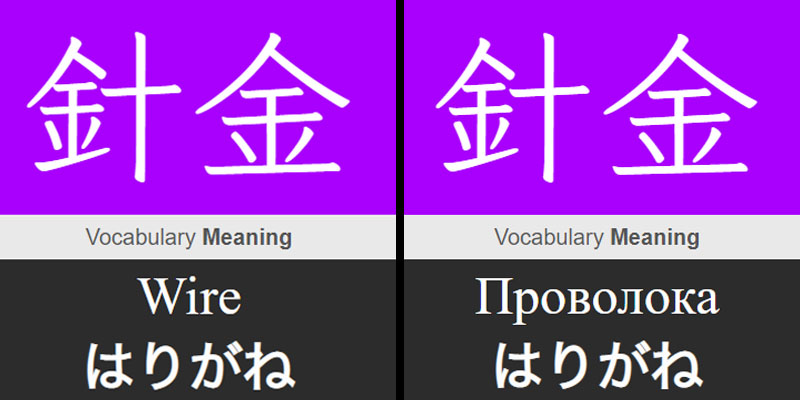

Автоматически переводит содержимое указанного поля в карточках Anki.



---

## 🌟 Особенности

- **Гибкая настройка** через `config.json`
- Поддержка **вложенных колод** (например, `"deck_name": "Wanikani Ultimate::Vocabulary"`)
- **Без жестких лимитов** благодаря библиотеке [deep-translator](https://github.com/nidhaloff/deep-translator)
- Прогресс сохранаяется в _translation_progress.json_. В случае останвки скрипта, перевод продолжится с последней карточки

---

## ⚙️ Требования

1. [Anki](https://apps.ankiweb.net/) с установленным плагином **[AnkiConnect](https://ankiweb.net/shared/info/2055492159)**  
   _Как установить:_  
   `Tools → Add-ons → Get Add-ons → Введите код 2055492159`

## 🛠️ Установка

```bash
# 1. Клонируйте репозиторий
git clone https://github.com/ваш-логин/anki-translator.git

# 2. Установите зависимости
pip install -r requirements.txt
```

Я протестировал этот скрипт на 6352 карточках WaniKani `Ultimate::Vocabulary` без каких либо ошибок.
